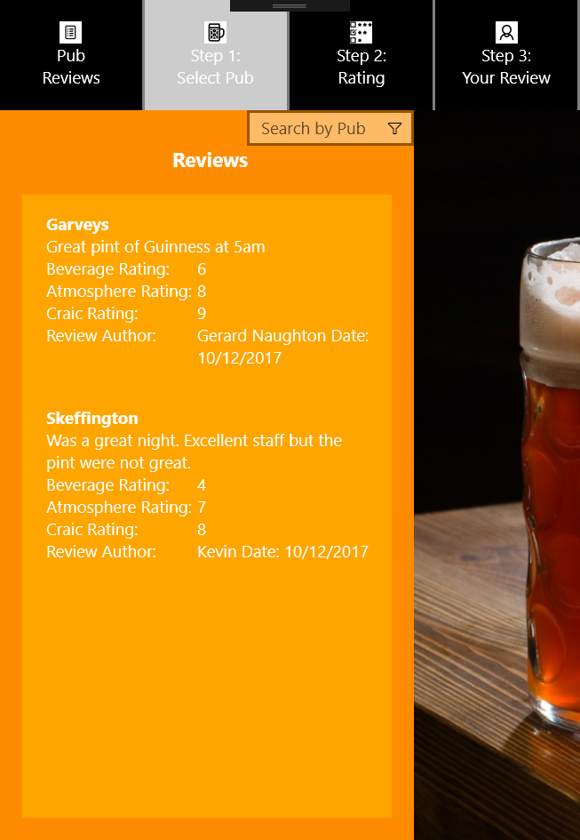

# 4th_year_uwp_project

## Project Overview

For our 4th year Mobile Applications project we were set guidlines from our lecturer Damian Costello as follows:

Create a Windows 10 UWP App. The application should incorporate the following elements:

* A responsive UI across the Windows 10 devices. There are some available for testing and this includes the IoT core, mobile devices, tablet and PC. This includes Visual State Management and using available SDKs for individual device types.

* A UI that has been well designed and is fit for purpose. User Experience should be carefully considered while developing the application. The User Experience should be consistent
across devices.

* Mobile services for data storage and retrieval. The cloud service does not have to be written
in C# to be able to interact with a UWP. The preferred cloud to use is Azure.

* Use of the MVVM design pattern in the development approach.

## My Project

I created a Windows 10 UWP app using Azure as my Mysql database service. I wrote my code using visual studio and configured my back end with my Azure Portal.

## What does my App do?

I created a Galway Pub Review App. The App allows the user to view Galway pub reviews, Search a list of reviews by pub, create a review in a step by step guide and post their review to our database.

The App consists of 5 pages which are framed around a nav-bar and image on the right hand side.

The page includes:

1. PubsReviewPage: Displays the list of pub reviews and allows to search by pub.

2. SelectPubPage: This is Step 1 of making a review where you can select a list of pubs you want to review

3. RatinsPage: Is the next step of making a review and allows the user to rate the pub on Beverage, atmosphere and craic out of 10.

4. YourReviewPage: This is the final page, the user will enter there name/nickname and personal review and will submit all the review to the database. 

### Here is some images of my app.

Your Review Page | Select Pub Page | Ratings Page | Review List Page
------------------|---------------------|-------------|---------------
|| | 

## What is a UWP App?

UWP stand for Universal Windows Platform. It provides a common app platform for array device that run windows 10. Ranging from desktop, laptop, phone, tablet and other smaller devices. This platform allows you to create a single app package which can be deployed on different devices. It also allows to target single devices out and uniquely custom them to that device properties.

## What is Azure?

Azure is a comprehensive set of cloud services that developers and IT professionals use to build, deploy, and manage applications through our global network of datacenters. Integrated tools, DevOps, and a marketplace support you in efficiently building anything from simple mobile apps to internet-scale solutions. For my UWP application i use a Azure cloud service to host a mysql database to store my users reviews.

## What is MVVM

MVVM stands for Model, View and View Model. MVVM is a software architectural pattern. MVVM facilitates a separation of development of the graphical user interface.

1. Model
The Model represents the actual data that we are dealing with. An example of a model would be a contact(containing name, phone number, address). A Model should know nothing about the user experience - specifically the View or how it is implemented using a
ViewModel. 

2. View Model
The ViewModel is where you encapsulate any code or data that your UX or
View will need. It is important that ViewModel only knows about and encapsulates the
Model – but it shouldn’t be responsible for any Business Logic or Business Constraints – that
should all be in the model. And on the other side, the ViewModel should know nothing
about the specifics of the Views and UX that use it.

3. View
This is where you create the user experience – in Windows apps you do this
declaratively with XAML markup language and design tools. The View uses properties and
actions on the ViewModel to get the job done.

## Learning Curve

I Learned a great deal on this project. Especially with cross platform design and how a well thought out project can help. Using grids and visual state manager it allows you to use your application over a wide array of devices with a better user interface. Also this was my first time working with azure. I used Azure cloud service to host a mysql database with a table for holding my users reviews. As with a every new technology it took a while to get use too but quickly learned  

## References

* [Microsoft UWP](https://docs.microsoft.com/en-us/windows/uwp/get-started/universal-application-platform-guide)
* [Azure](https://docs.microsoft.com/en-us/azure/) 
* [MVVM](https://msdn.microsoft.com/en-us/library/hh848246.aspx)
* [Tutorials from MSDN Channel9](https://channel9.msdn.com/Series/Windows-10-development-for-absolute-beginners)
